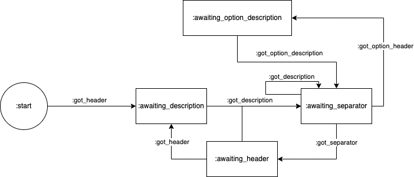

# Puppet lint param check

This is an extensive, opinionated check for valid parameter comments. It checks if the following criteria are matched:

- All parameters are documented
- @param-tags are separated from another by one empty line
- The description of a @param tag is always indented in the next line
- The @option comments directly follow the corresponding hash @param tag without a separator
- @param tags are sorted like the parameters they document

```
# @param mandatory
#   A mandatory parameter
# @option mandatory [String] hashkey
#   A key of the hash "mandatory" named "hashkey".
#
# @param withdefault
#   A parameter with a default value
#
# @param optional
#   An optional parameter

class my_class {
    Hash $mandatory,
    Boolean $withdefault = false,
    Optional[String] $optional = undef,
```

## Development

This check uses a finite state machine to work through the expected list of parameters.

The workflow used by the fsm can be visualized like this:



## Usage

To use the plugin, add the following line to the Gemfile:

    gem 'puppet-lint-param_comment-check'
